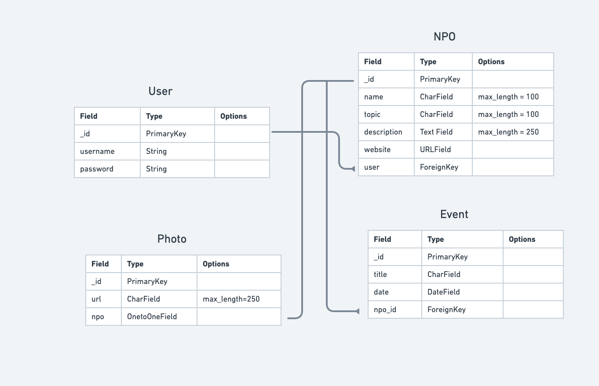
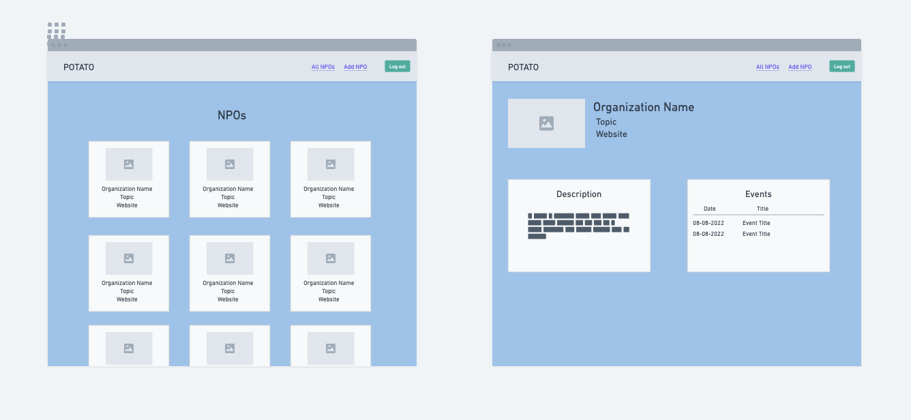
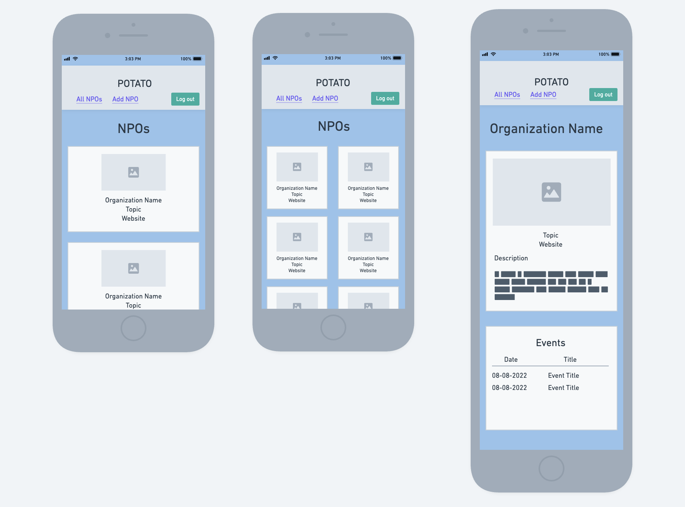
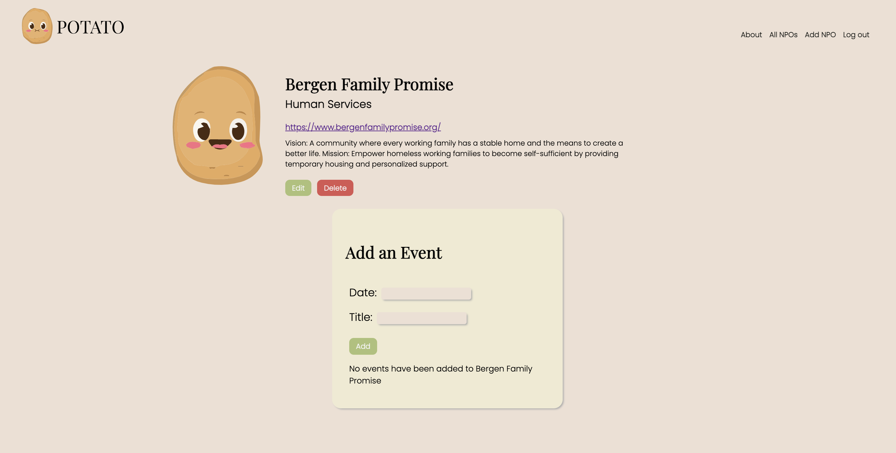
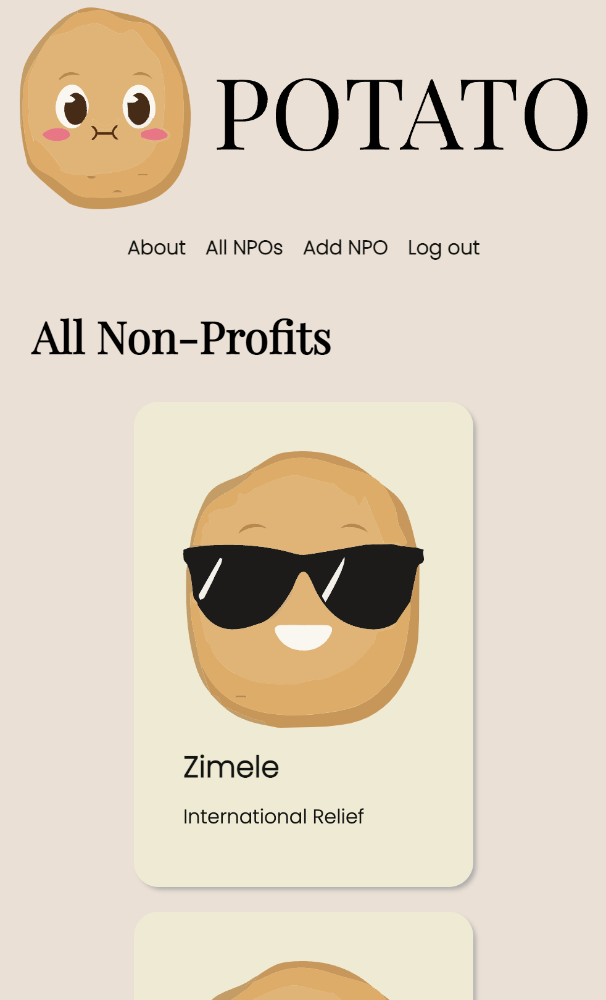

# POTATO
[Click here to get to the Deployed Link](https://npo-collector.herokuapp.com/)

## Getting Started  
A place where non-profit organizations can be added with their events.

Users are able to:
- create, edit, and delete non-profit organizations.
- create and delete events related to the non-profit organizations.

## Planning  

[Click here to get a closer look at our Trello Planning Materials](https://trello.com/b/vgBI2heX/potato)

### ERD & Wireframe
#### [Click here to get a closer look to the ERD and Wireframe](https://whimsical.com/npo-collector-LyHDA2xNDopz76tc7SEyAE)

### Website Preview

### Mobile Preview

## Technologies Used:
  
  
  
  
  
  

## Next Steps
- [x] For everyone to see all the organizations added
- [x] Users are able to add their own photos for each organization